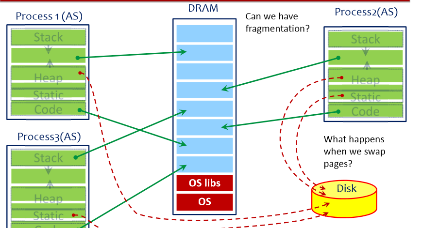
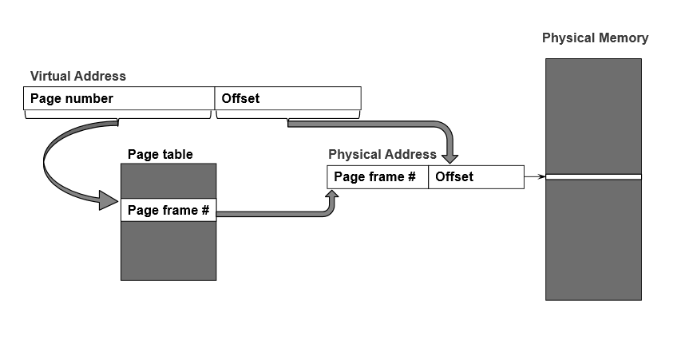
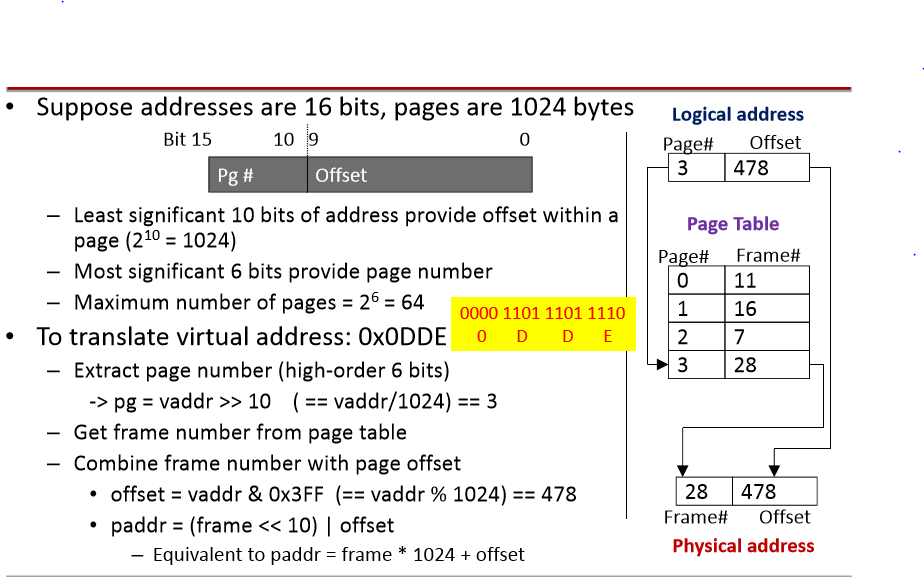
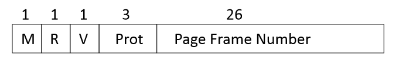

# Synchronization, Condition Variables, Monitors

## Semaphore Limitations
* Can be hard to reason.
* May want a **more complex wait condition.**
* Must **be checked outside the P().**
* Checking **requires mutual exclusion** (easy to stuck).

## Condition Variables
If no one is waiting, signal or broadcast has no effect. Not recorded for later use, as with semaphore V();

### Using Condition Variables
* **Always** used together with locks.
```C
lock_acquire(lock);
while(condition not true) {
    cv_wait(cond, lock);
}
... // do stuff
cv_signal(cond);
lock_release(lock);
```

## Readers-Writers problem
```C
// Number of Readers
int readcount = 0;

// mutual exclusion to readcount
Semaphore mutex = 1;

// exclusive writer or reading
Semaphore w_or_r = 1;

Writer() {
    P(w_or_r); // lock out others
    Write();
    V(w_or_r); // up for grabs
}

Reader() {
    P(mutex); // Protect readcount
    readcount += 1;
    if (readcount == 1)
        P(w_or_r);
    V(mutex);
    Read();
    P(mutex);
    readcount -= 1;
    if (readcount == 0)
        V(w_or_r);
    V(mutex);
}

```

## Monitors
* An abstract data type (data and operations on the data) with the restriction that only one process at a time can be active within the monitor.
    * Monitor enforces mutual exclusion
    * Local data accessed only by the monitor's procedures

### Hoare Monitors
* signal() immediately switches from the caller to a waiting thread
* The condition is guaranteed to hold when the waiter resumes

### Mesa Monitors
* signal() places a waiter on the ready queue, but signaler continues inside monitor.
* Condition is not necessarily true when waiter resumes, must check again

## Using Monitors in C
* Bounded buffer
    * Producers add to the buffer if it is not full.
    * Consumers remove to the buffer if it is not empty.
* Two functions: add_to_buffer() and remove_from_buffer()
* One lock: only lock holder is allowed to be active in one of the monitor's functions.
* Two conditions: one to make producers wait, one to make consumers wait.

```C
#define N 100

typedef struct buf_s {
    int data[N];
    int inpos; // producer inserts here
    int outpos;// consumer removes from here
    int numelements;
    struct lock *buflock;
    struct cv *notFull;
    struct cv *notEmpty;
} buf_t

void add_to_buff(buf_t *b, int value) {
    lock_acquire(b->buflock);
    while (b->numelements == N)
        cv_wait(b->notFull, b->buflock);

    b->data[b->inpos] = value;
    b->inpos = (b->inpos + 1) % N;
    b->numelements++;

    cv_signal(b->notEmpty, b->buflock);

    lock_release(b->buflock);
}
int remove_from_buff(buf_t *b) {
    int val;
    lock_acquire(b->buflock);
    while(b->numelements == 0) {
        cv_wait(b->notEmpty, b->buflock);
    }
    val = b->data[b->outpos];
    b->outpos = (b->outpost + 1) % N;
    b->numelements--;
    cv_signal(b->notFull, b->buflock);
    lock_release(b->buflock);
    return val;
}
```

# Scheduling
## Thread Life Cycle
* Threads repeatedly alternate between computation and I/O
    * CPU burst and I/O bursts
    * CPU-bound: very long CPU bursts, infrequent I/O bursts.
    * I/O-bound: short CPU bursts, frequent I/O bursts.
* During I/O bursts, CPU is not needed.

## Scheduling Goals
* All systems
    * Fairness
    * Avoid starvation
    * Policy enforcement
    * Balance - all parts of the system should be busy.

* Batch System
    * Throughput - maximize jobs completed per hour
    * Turnaround time - minimize time between submission and completion
    * CPU utilization - keep the CPU bust at all time.

### More Goals
* Interactive Systems.
    * Response time.
    * Proportionality - "simple" task complete quickly

* Real-time systems
略

## Type of CPU Scheduling
* Long-term (admission scheduling, admission control)
    * Used in batch system, not common.
* Medium-term (memory scheduling)
    * Decides which processes are swapped out to disk.
* Short-term (dispatching)

## When to Schedule
* When a thread **enters Ready state**
* When running **thread blocks (or exits)**
* At fixed intervals

## Type of Scheduling
* Non-preemptive Scheduling
    * process keeps the CPU until terminates or blocks
    * Suitable for batch Scheduling
* Preemptive Scheduling
    * Needed in interactive or real-time systems

## Scheduling algorithms
### FCFS (Non-preemptive)
略

### Shortest-Job-First (SJF, SPN)
* Provably optimal with respect to average wait time.

### Round Robin
* Ready queue is circular
* Choice of quantum is critical
    * we want q to be large with respect to the context switch time.

## Priority Scheduling
* A low priority task may prevent a high priority task from making progress by holding a resource (priority inversion)
* A low priority task may never get to run (starvation)

## Multi-Level Queue Scheduling
* Have **multiple ready queues**
* Threads are **permanently** assigned to a queue.
* Each queue has **its own scheduling algorithm**
* Another level of scheduling decides **which queue to choose next**

## Feedback Scheduling
* Adjust criteria for choosing a particular thread based on past history.
    * Threads that have waited a long time (aging)
    * Threads that do not use full quantum
* Use a multiple queue (MLQ) to move threads between queues.
    * Called _multi-level feedback queue (MLFQ)

## Fair Share Scheduling
* Group threads by user or department
* Ensure that each group receives a proportional share of the CPU

## Unix CPU Scheduling
* Interactive threads are favoured
* The more CPU time a thread accumulates, the lower its priority becomes.
* Aging prevents starvation.
* New Unixes reschedule threads every 0.1 seconds and recompute priorities every second.


# Memory management
## Goals:
1. Efficiency
2. Transparency
3. Protection and sharing

* Internal Fragmentation
    * If process is smaller than partition.
* External Fragmentation
    * Hole that is too small to be reused when a process terminates
* Overlays
    * If process needs more than partition.

## Fixed partitioning
* Internal Fragmentation
* Overlays
* Number of partitions is limited.

## Dynamic Partitioning
* External Fragmentation
* OS may move processes around to create larger chunks of free space (compaction)
    * Requires processes to be relocatable
* Need to know maximum size of process at load time

## Paging


Hardware (MMU) converts VAs into PAs using the Page Table.
Each process running in the OS has its own Page Table

## Page Faults
* Page table entry indicates that the page is not in memory.
* How to handle?
    * OS is responsible for loading page from disk
    * Process stops until the data is brought into memory.
    * Page replacement policy is up to the OS.

## Why not too slow?
* Localized patterns
    * Temporal locality
    * Spatial locality
* Although cost of paging is high, it is infrequent enough to be acceptable

## Protection and sharing
* Access rights are kept in the page tables
    * Page tables are in protected OS memory.
* Allow sharing pages, like read-only library code.

## Translation
### Requirements:
* Relocation
* Logical organization
* Physical organization

### Address binding
Address translation is the process of linking variable names to physical locations.

### When are address bound?
* Compile time
    * Called _absolute code_
    * No relocation is possible
* Load time (static relocation)
* execution time (dynamic relocation)

## Dynamic relocation
* Hardware support: 2 registers called base and bound.
* The executable stores virtual addresses
* Need bound register to ensure that we don't access outside a process' address space.
* Base and bound get saved in the PCB when we do a context switch

## Placement Algorithms
* Best-fit
    * left-over fragments tend to be small
* First-fit
    * Simplest, and often fastest and most efficient
    * May leave many small fragments near start of memory.
    * Free space becomes fragmented more rapidly.
* Worst-fit
    * Not as good as previous two algorithms
* Quick-fit
    * Great for fast allocation, generally harder to coalesce

## Paging
* Virtual addresses interpreted as **page number + page offset**
    * **page number = vaddr / page_size**
    * **page offset = vaddr % page_size**
* On each memory references, processor MMU translates page# to frame# and adds offset to generate a physical address.



* 32-bit virtual address, 4K (4096 bytes) page
    * Page size, virtual address size set by MMU hardware
    * Offset must be 12 bits (2^12 = 4096)
    * Leaves 20 bits for virtual page number (VPN)

* Program generates virtual address 0x7468
    * CPU and MMU see binary 0111 0100 0110 1000
    * Virtual page is 0x7, offset is 0x468
* Page table entry 0x7 contains 0x42
    * Page frame number is 0x42
    * Virtual page 0x7 is stored in physical frame 0x42
* **Physical address** = 0x42<<12 + 0x468 = 0x42468

## The Page Table
* Simplest version
    * A linear array of page table entries, 1 entry per virtual page.
    * Stored in **OS memory, attached to process structure**
    * Virtual page number (VPN) is array index
    * Allocate enough physical memory (ppages) for entire page table.

### Page Table Entries

* Modify bit (M)
* Reference bit (R)
* Valid bit (V)
* Protection bits
* Page frame number (PFN) determines physical page

### Page Limitations
* Memory required for page table can be large.
