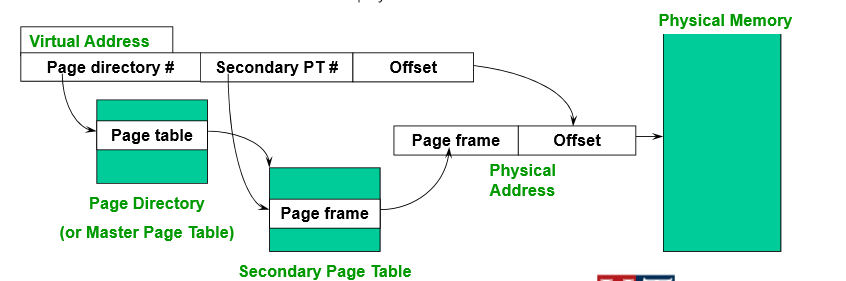

# Page Virtual Memory
* Reduce space overhead
    * Observation: Only need to map the portion of the address space actually being used.
* How do we only map what is being used?
    * Use **3 page tables - one per logical segment** (code, stack, heap)
    * Need base register, limit register -> 3 pair of base/bound registers.

## Multi-level page tables
* Split page table into **pages of PTEs**
* Use a **page table directory** to point to different pages of PTEs.

## Two-Level Page Tables

Virtual address (VAs) have three parts.
Page directory number, secondary page number, and offset.

### Tradeoff: space vs. time
* Multi-level page table
    * Saves space.
    * Add more levels of indirection when translating addresses.
    * More complexity in the translation algorithm.

### Hashed Page Tables

### Inverted Page Tables
* Keep only one page table for the whole system.
* Less space, but looks up are slower.

### Paging Limitations - Time
* Memory references overhead
    * 2 memory reads per address lookup
    * Hierarchical page tables make it worse.
    * **Solution:** use a hardware cache of lookups.
* Translation Lookaside Buffer (TLB)
    * Small, full-associative hardware cache of recently used translations.
    * Part of MMU.

## Translation Lookaside Buffer (TLB)
* Translates virtual page #s into PTEs
    * Done in a single machine cycle.
* TLBs are implemented in hardware.

### Managing TLBs
* Hardware-loaded.
    * Knows where page tables are in main memory (PTBR)
    * OS maintains tables in memory, HW accesses them directly.
* Software-loaded.
    * TLB faults to the OS, OS finds appropriate PTE, loads it in TLB.

## Virtual Memory Management Policies
* Fetch Policy - When to fetch a page.
* Placement Policy - Where to put the page.
* Replacement Policy.

### Demand Paging
* Only dirty pages need to be written to disk, clean pages do not.
### Prepaging
略

## Placement Policy
略

## Page Replacement Policy
* Goal: to reduce the fault rate by selecting the best victim page to remove.
* Replacement algorithms are evaluated on a **reference string** by counting the number of page faults.

### Belady's Algorithm
* Replace the page that will not be used for the longest period of time.
#### FIFO
* Suffers from "Belady's Anomaly". The fault rate might actually increase when the algorithms is given more memory.

#### Least Recently Used (LRU)
* Option1:
    * Time stamp every reference.
    * Problem:
        * Need larger PTE.
        * Need to examine every page on eviction.
* Option2:
    * Keep pages in stack.
    * Problem:
        * Costly software operation to manipulate stack.

##### Approximation LRU
* Use the PTE reference bit.
* All R bits are zero initially.
* Periodically examine the R bits.
* Additional-Reference-Bits Algorithm
    * Keep a counter for each page.
    * At regular intervals:
        * Shift R bit into high bit of counter register.
        * Shift other bits to the right.
        * Pages with "larger" counters were used more recently.

#### Second Chance Algorithm
* FIFO, but inspect reference bit.
    * If R is 0, replace the page.
    * If R is 1, change to 0, continue.

##### Implementation (clock)
* Arrange page frames in a big cycle.
* A clock hand is used to select candidate.

#### Counting-based Replacement
* Least-Frequently-Used (LFU)
* Most-Frequently-Used (MFU)
Both are poor approximations of OPT.

# Paging Design & Implementation
## Thrashing
* Page replacement algorithms should avoid thrashing.
    * More time is spent by the OS in paging data back and forth from disk than executing user programs.
    * In this situation, the system is **overcommitted/oversubscribed**
    * Possible Solutions
        * Swapping - write out all pages of a process and suspend it.
        * More memory.

## CPU utilization
* It is not a good idea to increase the degree of multiprogramming.
    * Less memory to each program => higher page fault.

## Page Buffering
* Most of the page replacing algorithms are too costly to run on every page fault.
* Maintain a pool of free pages.
* Run replacement algorithm when pool becomes too small.
* On page fault, grab a frame from the fee list.
* Frames on free list still hold previous contents, can be rescued if virtual page is referenced before reallocation.

## Addressing Page Tables
Where do we store page tables?
* Physical Memory.
    * No translation needed.
* Virtual Memory.

## Fixed vs. Variable Space Allocation
* How to determine how much memory to give to each process?
    * Fixed space algorithms
        * Each process is given a limit of pages it can use.
        * When it reaches the limit, replaces from its own pages.
    * Variable space algorithms
        * Process's set of pages grows and shrinks dynamically.

## Working Set Model
* used to model dynamic locality of its memory usage.

### Working Set Size
* Number of pages in the working set.
* Changes with program locality.
    * More pages during periods of poor locality.
* Want the working set to be the set of pages a process needs in memory to prevent heavy faulting.
    * Don't run a process unless working set is in memory.

* Working set is not used in practice.
    * Unknown parameter
    * Don't know when changes.

## Sharing
* Have PTEs in both tables map to the same physical frame.
* Each PTE can have different protection values.
* Must update both PTEs when page becomes invalid.

## Copy on Write
* to defer large copies.
* instead of copying pages, create shared mappings of parent pages in child virtual address space.
