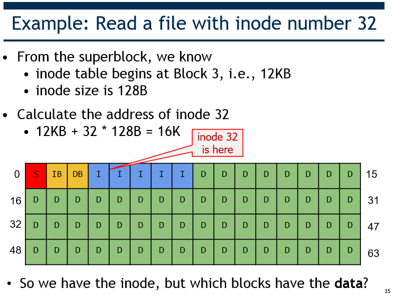
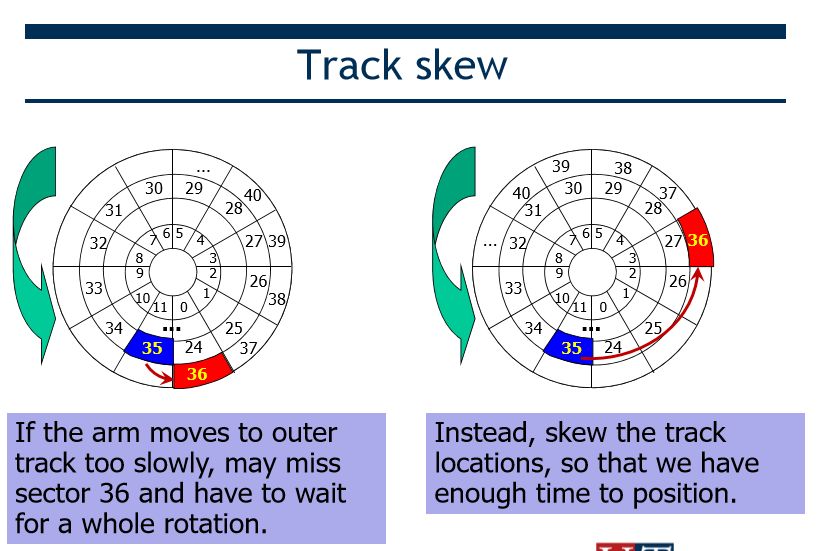
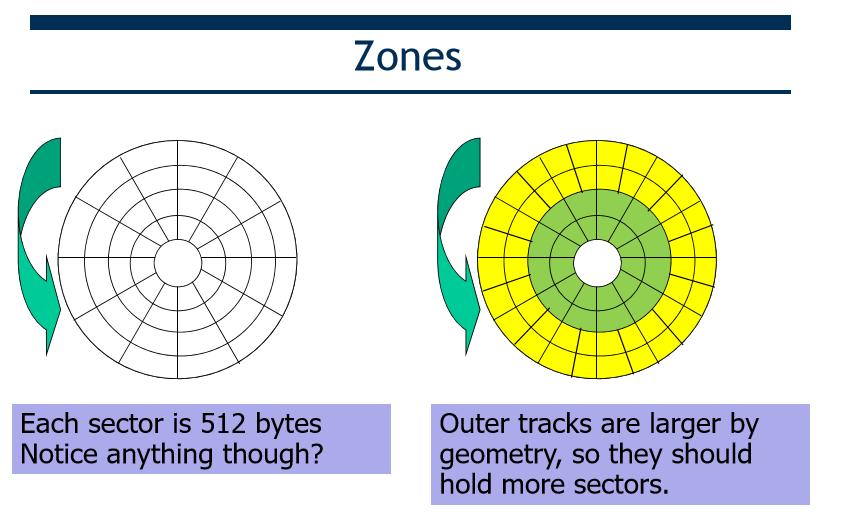
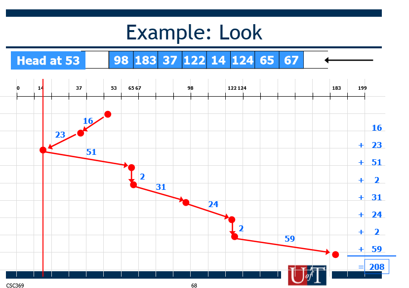

# File System
* Requirements:
    1. Store very large amounts of information.
    2. Information must survive the termination of process using it.
    3. Multiple processes must be able to access info concurrently.
* Two views:
    1. User view
    2. OS view

## File Sharing
* Two key issues:
    1. Semantics of concurrent access
    2. Protection

## Directories
* For users, provide a structured way to organize files.
* For file systems, provide a convenient naming interface that allows implementation to separate logical file organization.
* A directory is a list of entries.
* Usually unordered.

### Possible Organizations
* single-level, two-level, tree-structured
* acyclic-graph allows same file or subdirectories in 2 different directories.

### Directory Implementation
* Linear List
* Hash Table

## File Links
* Hard links: Second directory entry identical to the first.
* Soft links: Directory entry refers to file that holds "true" path to the linked file.

## Issues with Acyclic Graphs
* With links, a file may have multiple absolute path names.
* Maintaining consistency.
* Deletion.

## File System Implementation
* File Systems define a block size
* A "Master Block" determines location of root directory.         
* A free map determines which blocks are free.

## Disk Layout Strategies
1. Contiguous
2. Linked/Chained
3. Indexed

# Disk I/O and File System Optimization

## Extend-based
* An extend == a disk pointer plus a length (in # of blocks).
* Instead of requiring a pointer to every block of a file, we just need a pointer to every several blocks.
* Disadvantage: Less flexible than the pointer-based approach.
* Advantage: Uses smaller amount of metadata per file.

## Linked-based
* Instead of pointers to all blocks, the inode just has one pointer to the first data block of the file, then the first block points to the second block, etc.
* Works poorly if we want to access the last block of a big file.
* Use an in-memory File Allocation Table, indexed by address of datablock.

## File Buffer Cache
* Applications exhibit significant locality for reading and writing files.
* Cache file blocks in memory to capture locality.

## Caching and Buffering
* Static partitioning: at boot time, allocate a fixed-size cache in memory.
* Dynamic partitioning: integrate virtual memory pages and file system pages into a unified page cache.
* Replacement policy: LRU

## Caching Writes
* Use a buffer to buffer writes. Buffering a batch of disk writes.
    * Combine multiple writes into one write.
    * Avoid some writes.

Caching and buffering improves the speed of file system read and writes.
However, it sacrifices the durability of data.
* Approaches
    * Delayed writes only for a specific amount of time.
    * Asynchronous writes ("write-behind")
    * Battery backed-up RAM
    * Log-structured file system.

## Read Ahead.
* Predicts that the process will requires next block.
* Goes ahead an requests it from the disk.
* Big win for sequentially accessed files.

## Disk Performance
* Seek - moving the disk arm to the correct cylinder.
* Rotation - waiting for the sector to rotate under the head
* Transfer - transferring data from surface into disk controller.

## Disk Interaction
* Cylinder #, surface #, track #, sector #, transfer size...
* Current disks provide a higher-level interface (SCSI)
    * exports its data as a logical array of blocks.

## High-level disk characteristics yield two goals:
* Closeness
    * reduce seek time by putting related things close to each other.
* Amortization
    * amortize each positioning delay by grabbing lots of useful data.

## Allocation strategies
Disks perform best if seeks are reduced and large transfers are used.
* Scheduling requests
* Allocating related data "close together" on the disk.

## FFS: A disk-aware file system
* Problem 1: Fragmentation of a aging file system causes more seeking.
* Problem 2: Inodes allocated far from blocks.

### FFS
#### Cylinder Groups
* BSD FFS address placement problem using the notion of cylinder group.
    * Disk partitioned into groups of cylinders.
    * Data blocks in same file allocated in same cylinder group.
    * Files in same directory allocated in same cylinder group.
    * Inodes for files are allocated in same cylinder group as file data blocks.
* Provides closeness
* 10% of the disk is reserved. When allocating large files, break it into large chunks and allocate from different cylinder groups, so it does not fill up one cylinder group.

## Disk Scheduling Algorithms
* Goal: Minimize seeks.
* Polices:
    * FCFS
        * Reasonable when load is low.
    * SSFT (shortest seek time first)
    * SCAN
        * Service requests in one direction until done, then reverse.
    * C-SCAN
        * Only go in one direction
    * LOOK / C-LOOK
        * Only go as far as last request in each direction.

## File System Comparison

## FAT
* Directories map file name to first block of file.
* Stores both the linked list of blocks belonging to files and free blocks.
* Limitations
    * Poor random access
    * Poor locality
    * Limited file metadata and access control

## Ext2, Ext3, Ext4
略

## FFS: Consistency Issues
* Inodes: fixed size structure stored in cylinder groups.
* File system operations affect multiple metadata blocks.
    * Write newly allocated inode to disk before its name is entered in a directory.
    * Remove a directory name before the inode is deallocated.
    * Deallocate an inode before that file's data blocks are placed into the cylinder group free list.

### Crash Recovery
* fsck - post-crash recovery process to scan file system structure and restore consistency.
* Log updates to enable roll-back or roll-forward.

* **Just DB write succeeds**
    * No inode, no bitmap => as if the write did not occur.
    * Consistent but data lost.
* **Just I[v2] write succeeds**
    * No data block => will read garbage from disk.
    * No bitmap entry
* **Just B[v2] write succeeds**
    * DB can never be used again.
* **Only I[v2] & B[v2]**
    * FS metadata is consistent.
    * DB contains garbage.
* **Only I[v2] & DB**
    * Inconsistent
* **Only B[v2] & DB**
    * Inconsistent

## fsck
* What does it check?
    1. Superblock
        * Use another superblock copy.
    2. Free blocks
        * inodes / bitmaps inconsistency.
        * Ensure inodes in use are marked in inode bitmaps.
    3. Inode state
        * If cannot fix => remove inode and update inode bitmap.
    4. Inode links
        * If inode discovered, but no dir refers to it => move to "lost+found"
    5. Duplicate inodes
    6. Bad blocks (outside of valid range)
    7. Directory checks
* Limitations
    * too slow.
    * cannot do anything about lost data.

## Journaling (Write-Ahead-Logging)
* When doing an update, before overwriting structures, first write down a little note saying what you plan to do.
* If crash => go back to journal and retry the actual writes.
* If crash before journal write finishes, doesn't matter.

### What goes in the note

* Sequence of operations
    1. Write the transaction to the block.
    2. Write the blocks to the file system.
    3. Mark the transaction free in the journal.
* If crash between 1 & 2, redo logging.
* If crash during 1
    * Split 1 into 2 steps
        1. Write all except TxEnd to journal (Journal Write Step)
        2. Write TxEnd (Journal Commit Step)
        3. Checkpoint step.
        4. Free step.

### Journal Space Requirements
* circular log
* Metadata Journaling
    * No actual data to the note.
    * Write data before writing journal.

## Log-Structured File System (LSF)
* Write all file system data in a continuous log.
* Each segment has a summary block that contains pointer to next one.
* Need fresh segment => first clean an existing partially used segment (garbage collection)
* Hard to find inode - scattered all over the disk. Need an inode botmap.
* Checkpoint region (CR)
    * Pointers to the latest pieces of the inode map.

### Crash Recovery
* LFS normally buffers writes in segment
    * When full, writes segment to disk.
* Keep two CRs.

### Garbage Collection
* LFS repeatedly writes latest version of a file to new locations on disk.
* Must clean up old versions. 
* Cleaning done on a segment-by-segment basis

## Virtual File System (VFS)
* An user level interface.

## Redundancy
* In case of disk failures.
* RAID
    * Data duplicated
    * Data spread out across multiple disks with redundancy.
    * Concepts
        * Redundancy/Mirroring: keep multiple copies of the same block on different drives.
        * Parity information: XOR each bit from 2 drives, store checksum on 3rd drive.
